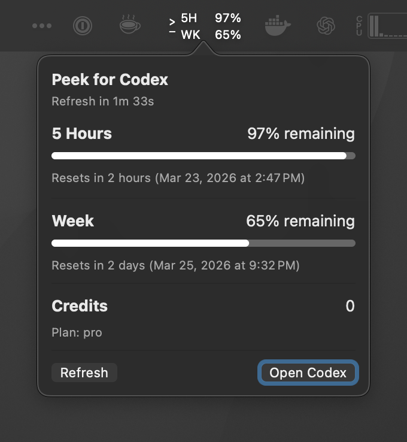

# Peek for Codex

Codex usage, rate limits, and credits, one peek away

Peek for Codex is a lightweight native macOS menu bar app that keeps your Codex 5-hour and weekly usage one peek away, with optional credits in the popup



## Why Peek for Codex

- No extra login, API key, or macOS privacy permissions required
- Built specifically for Codex, not a generic AI dashboard
- Native macOS menu bar app, lightweight and always available
- Shows 5-hour and weekly usage right in the menu bar
- Optional credits in the popup
- Launch at login support
- Simple install: clone the repo and run one script

## Requirements

- macOS 14 Sonoma or later
- Codex CLI installed
- Xcode Command Line Tools

## Install

If you already use Codex, you can simply ask it to clone this repo, run `./scripts/install.sh`, and open the installed app from `~/Applications`

```bash
git clone https://github.com/JacopoBassan/Peek-for-Codex.git
cd Peek-for-Codex
./scripts/install.sh
open ~/Applications/Peek\ for\ Codex.app
```

## How it works

- Shows your 5-hour and weekly Codex usage in the menu bar
- Opens a native popup with remaining quota, reset timing, and optional credits
- Uses your existing local Codex setup through the local `codex app-server`
- Does not ask you to log in again, paste an API key, or grant macOS privacy permissions
- Stores app preferences such as refresh timing and credits visibility locally
- Uses a user LaunchAgent for launch at login

If you find Peek for Codex useful, consider starring the repo on GitHub
